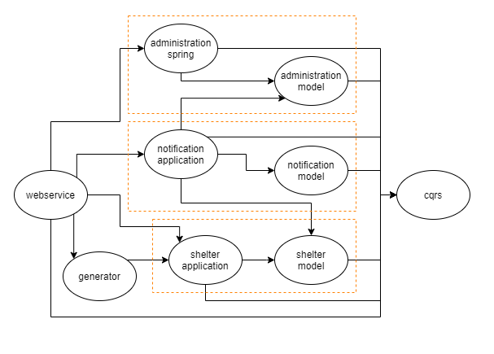
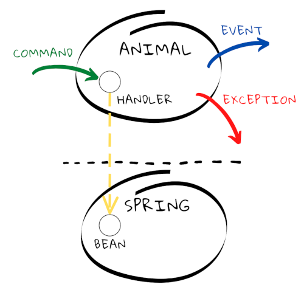
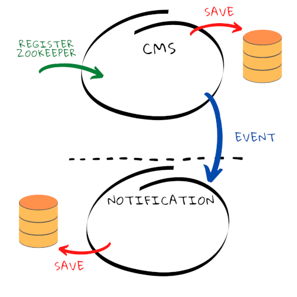
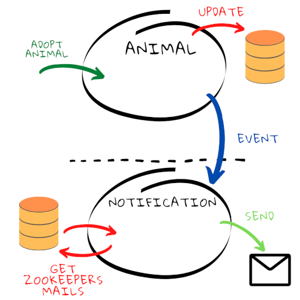

# Table of contents

1. [About](#about)
2. [Blog entries](#blog-entries)
3. [Application big picture](#application-big-picture)
3. [Summary](#summary)

## About
This is a project of animal shelter. The main reason to create it is rewriting 
[previous one](https://github.com/DevCezz/animal-shelter-old). Thus, I want 
to check how much I have learned since that time.   

## Blog entries
I have described process of creating this app on my blog site. All entries
are available in Polish.

- [#1 Description of project AnimalShelter](https://devcezz.pl/2020/12/22/przepisz-swoj-kod-na-nowo-1/)
- [#2 First steps in backend](https://devcezz.pl/2020/12/30/przepisz-swoj-kod-na-nowo-2/)
- [#3 Refactoring and development of the server part](https://devcezz.pl/2021/02/08/przepisz-swoj-kod-na-nowo-3/)
- [#4 Creating GUI in Angular](https://devcezz.pl/2021/02/25/przepisz-swoj-kod-na-nowo-4/)
- [#5 Stop, think it over and start doing!](https://devcezz.pl/2021/04/10/przepisz-swoj-kod-na-nowo-5/)
- [#6 The idea for architecture](https://devcezz.pl/2021/04/26/przepisz-swoj-kod-na-nowo-6/)
- [#7 Using CQRS](https://devcezz.pl/2021/07/14/przepisz-swoj-kod-na-nowo-7/)
- [#8 Re-implementation](https://devcezz.pl/2021/08/11/przepisz-swoj-kod-na-nowo-8/)
- [#9 Architectural dilemmas](https://devcezz.pl/2021/10/13/przepisz-swoj-kod-na-nowo-9/)
- [#10 Summary + sending email implementation](https://devcezz.pl/2021/11/15/przepisz-swoj-kod-na-nowo-10/)
- [#11 Keep coding](https://devcezz.pl/2021/11/25/przepisz-swoj-kod-na-nowo-11/)

## Application big picture

This picture presents project division into Maven modules and their dependencies.
I've come up with this idea to have only external model jars in specific module
if there is no need for more. AnimalShelter project is based on events and CQRS
concept.

I try to have domain module which is technology-agnostic (beside the fact that
I use Java to code it). To achieve that I use Maven modules with the same
packages. One of them is based on Spring and registers required beans from
domain module, just like it is presented on above picture.

Of course there is registered event bus and command bus to handle events and
commands. In domain module there are only interfaces, but in Spring module 
concrete implementations are used.

I've decided to duplicate data about zookeepers being registered in shelter.
There are available in administration and notification module. This solution
has to solve future problem of making microservices. We will see what this 
architectural decision will bring.

The next decision in this matter is to share bytes of files between modules than
just path to them. For now this is more complicated solution, but in future it 
will be easier to extract microservices.

## Summary

I hope this code will bring you some tips about development. Please let me know
if you have some ideas how to improve my knowledge sharing or maybe how to make
this code better.